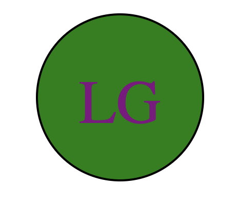

# Logo Generator

## Table of Contents
- [Description](#description)
- [Installation](#installation)
- [Usage](#usage)
- [License](#license)
- [Contributing](#contributing)
- [Tests](#tests)
- [Questions](#questions)

## Description
This application is designed to generate logos from inputted materials

## Installation
You must run npm install in your terminal and download the necessary node files.

## Usage
Run node index.js and answer the questions 

## License
Distributed under the MIT License.

## Contributing
Steve Weede

## Tests
After installing jest run npm run test in your terminal.

## Questions
Please send questions to:
steveweede@yahoo.com or to BabyStu at Github

